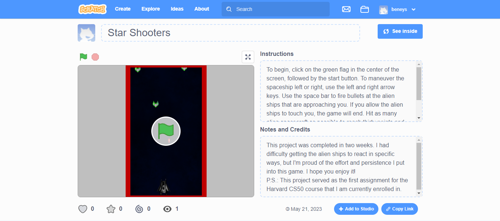

# Havard Cs50- Space shooter Game

This is a solution to theHavard CS50 Course Problem set 0 Using scratch. 

## Table of contents

- [Overview](#overview)
  - [Screenshot](#screenshot)
  - [Links](#links)
- [My process](#my-process)
  - [Built with](#built-with)
  - [What I learned](#what-i-learned)
  - [Continued development](#continued-development)
  - [Useful resources](#useful-resources)
- [Author](#author)
- [Acknowledgments](#acknowledgments)

## Overview

The task from Havard Cs50 was to create a Game or Tel a storry using sveral sprites and scripts using the scratch Programing Language. this document provides a detailed explanation of methodology and technologies used at different points; from inception to finalization of this project in order to achieve this end-result.

### Screenshot

### Links

- Live Site URL:(https://scratch.mit.edu/projects/840778412)

## My process

I started off by creating the basic structure of this game using scartch, then i gradually added different sprites and wrote the logic to control these sprites as per the guidelines in the problemset description. I then created a repository for this project on github.   

### Built with

- Scratch 3.0

### What I learned

- I lerand about conditionals
- Loops.
- Events.
- Arguements.

### Continued development
 I want to get better at programming by leaning about the fundamentals of programing in the future.

## Author

- Scratch.MIT - [Beneys](https://scratch.mit.edu/users/beneys/)
- Twitter - [BIG_BENNEY](https://www.twitter.com/BIG_BENNEY)

## Acknowledgments

I want to thank myself for sticking through this and finally finishing it. It is a testement of my will and determination to become a software developer. Thank you for taking these small baby steps.

